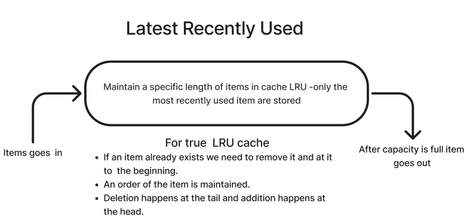
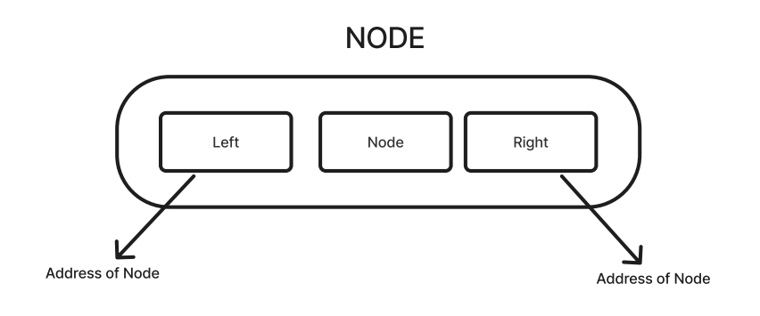
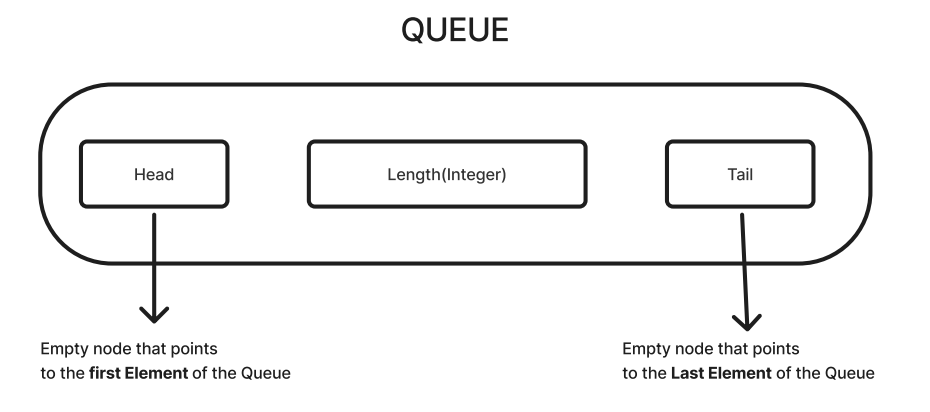
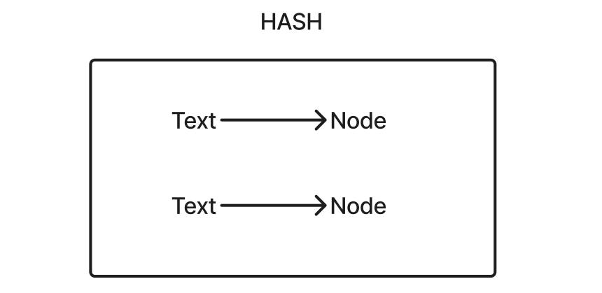
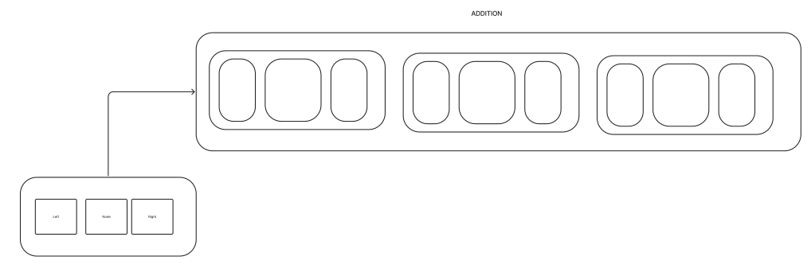
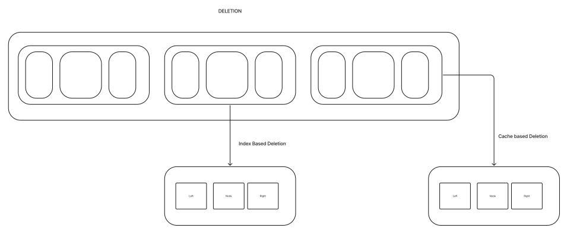

 <h1>LRU Cache Project </h1>

we build an LRU cache in Golang using data structures like linked lists, focusing on adding and deleting items efficiently. 

### Highlights

* 🛠️ Build your own cache in Golang.
* 🐍 Use data structures to create an LRU cache.
* ⚙️ Understand the basic operations of adding and deleting items.
* 📊 Maintain order in the cache for efficient access.
* 🗺️ Explore the relationship between nodes in linked lists.
* 🔄 Implement a hashing mechanism for quick lookups.
* 📈 Optimize cache usage by setting a maximum length.

### Workflow

#### LRU Cache

#### General Data Structures
##### Node

##### Queue

##### Hash

#### Addition of Nodes

#### Deletion of nodes

### Key Insights
* 🏗️ Building a Cache: The video emphasizes constructing a simple LRU cache in Golang, providing a practical application of data structures in real-world scenarios.
* 📚 Understanding LRU Mechanism: The importance of the Least Recently Used (LRU) strategy is explained, detailing how it helps manage data retention efficiently.
* 🔗 Linked Lists as a Core Structure: The use of linked lists is critical for maintaining the order of elements, enabling fast insertions and deletions without shifting entire arrays.
* 🗄️ Hashing for Efficiency: Implementing a hash map allows for quick checks and retrievals, significantly speeding up the cache operations compared to linear searches.
* ⚖️ Capacity Management: The concept of setting a maximum cache size is crucial for preventing memory overflow and ensuring that only relevant data is stored.
* 🚀 Intermediate Level Focus: The content targets those with a solid understanding of Golang, providing a challenge that enhances coding skills and knowledge of data structures.
* 🎓 Iterative Learning: The coding process is detailed step-by-step, promoting a better understanding of how data structures function together in a cohesive system.

#### Code Soon ...
