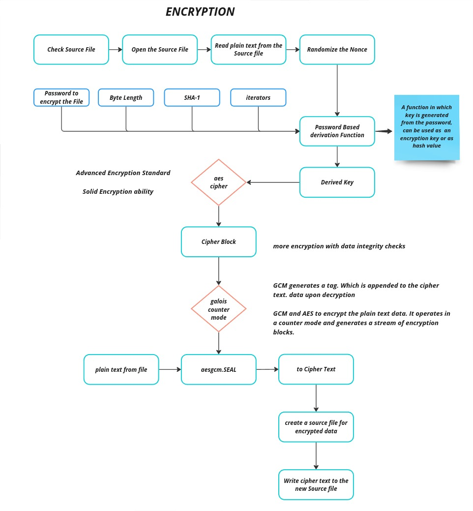
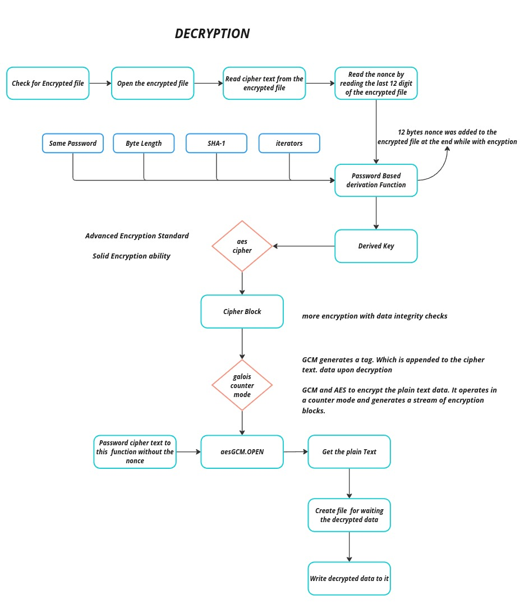

# Golang File Encryption

 With the Growing of software, there are many algorithms and methids to ensure data security. We need to keep sensitive information secure in many fields such as user password, file encryption, hard-disk encryption, phone encryption, email content encryption, data encryption in cloud environment etc.

 The Symmetric Encryption is one of these method. In this article, We are going to encrypt and decrypt a file using symmetric encryption technique.

    

## Encryption

To encrypt a file, we are going to use crypto package that Go’s built-in package.

First, we need a basic plain text to encrypt. To fill plain text, go this website take lorem-ipsum text and add it into the plain text.



To encrypt the data, we are going to use Seal function. The Seal function takes random nonce (number used once) array and additional data. The nonce has to be unique and it changes every time when data is encrypted.

```
	// GCM Function
	aesgcm, err := cipher.NewGCM(block)
	if err != nil {
		panic(err.Error())
	}

	ciphertext := aesgcm.Seal(nil, nonce, plainText, nil)
	ciphertext = append(ciphertext, nonce...)
```

## decryption

To decrypt the file, it is a simple reverse process. First we are going to read cipher text file. we need a block of algorithm and GCM mode as we used in encryption process.



We are going to decrypt a file using Open function. The Open function takes random nonce that we used in the encryption process, cipher text and additional data. The nonce is saved the beginning of the file.

```
    key := password
	salt := ciphertext[len(ciphertext)-12:]
	str := hex.EncodeToString(salt)
	nonce, err := hex.DecodeString(str)

	dk := pbkdf2.Key(key, nonce, 4096, 32, sha1.New)

	block, err := aes.NewCipher(dk)
	if err != nil {
		panic(err.Error())
	}

    aesgcm, err := cipher.NewGCM(block)
	if err != nil {
		panic(err.Error())
	}

	plainText, err := aesgcm.Open(nil, nonce, ciphertext[:len(ciphertext)-12], nil)
	if err != nil {
		panic(err.Error())
    }
```

Final step, the Open function decrypts and returns the file contents as byte array. We just have to save it into the destination path.

## Description

##### Encrypt source file
``` $ go run . encrypt /images/golang.png ```
#### Decrypt encrypted file
``` $go run . decrypt /images/golang.png ```
#### Help
``` $go run . help  ```

```
File encryption
Simple file encryption for your day-to-day needs.

Usage:

	go run . encrypt /path/to/your/file

Commands

	 encrypt	Encrypt a file given a password
	 decrypt	Tries to Decrypt a file using a password
	 help		Display help text
```